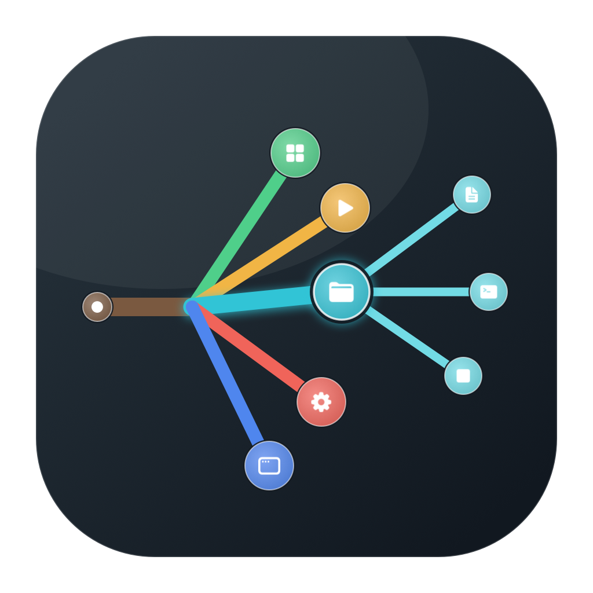

# Fractal

**A macOS fractal action launcher driven entirely by your trackpad.**

## Download

[**→ Download Fractal.zip from the latest release**](https://github.com/Smoep/fractal/releases/latest)

Unzip and drag **Fractal.app** to your Applications folder.

**First launch:** macOS will show a security warning because the app is not signed with an Apple Developer certificate. Right-click (or Control-click) the app → **Open** → **Open**. You only need to do this once.

Touch and hold the trackpad, move through the action tree, then lift. No mouse movement, no keyboard hunting — just one fluid gesture.

<p align="center">
  
</p>

## How it works

1. **Touch & hold** anywhere on the trackpad — a progress ring fills over about 0.6 seconds.
2. **The action tree appears** at your cursor, with categories branching from a short trunk.
3. **Move along a branch** to a category, then farther along its child branches to an action.
4. **Lift your finger** — the action fires instantly.

The tree root is always a cancel zone. Your finger never leaves the trackpad.

## What you can trigger

- **Keyboard shortcuts** — any key combo, recorded live from your keyboard
- **Launch apps** — open any application instantly
- **Shell commands** — run arbitrary scripts
- **Media controls** — play/pause, next/previous track, volume, mute

## Features

- Unlimited nesting — categories can contain subcategories at any depth
- Fully customizable menu via a built-in drag-and-drop editor
- Two selection modes: **lift-to-select** (fast) or **click-to-confirm** (forgiving)
- Lives in the menu bar — no Dock icon, zero visual clutter
- Glass-style overlay aesthetic native to macOS 26
- Per-app awareness — pause tracking when you don't need it

## Requirements

- macOS 26 (Tahoe) or later
- Xcode 26+ to build from source

## Build from source

```bash
git clone https://github.com/Smoep/fractal.git
cd fractal
xcodebuild -project Fractal.xcodeproj -scheme Fractal -configuration Release \
  -derivedDataPath build-fractal build
cp -R build-fractal/Build/Products/Release/Fractal.app /Applications/Fractal.app
open /Applications/Fractal.app
```

## License

GPL-3.0 — see [LICENSE](LICENSE).
